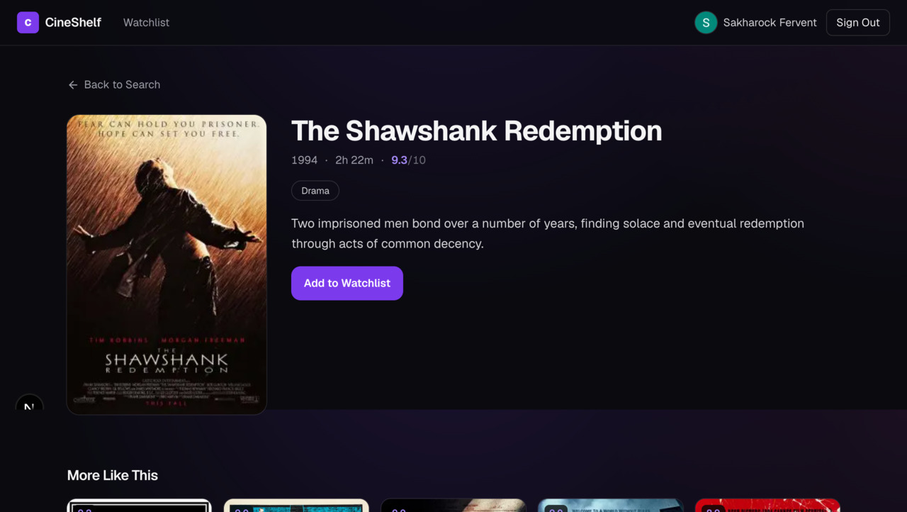

# CineShelf

[](https://github.com/Godsdar/CineShelf/actions/workflows/ci.yml)

A movie search app with real posters, a personal watchlist and sign-in.


## What it does

- Search by title or plot and filter by genre. The query lives in the URL, so results are shareable.
- Movie detail pages with a poster, rating and related films.
- A personal watchlist stored per user, behind sign-in.
- Sign in with GitHub, Google or an email magic link.
- 30 seeded films with real posters downloaded from Wikipedia, no API key.



## Stack

Next.js 16 (App Router, Server Components and Server Actions), React 19, TypeScript, Tailwind CSS v4, PostgreSQL 18 with Drizzle ORM, Auth.js v5, Bun.

## Run it

```bash
bun install && docker compose up -d
cp .env.example .env    # set AUTH_SECRET: openssl rand -base64 32
bun run db:migrate && bun run db:seed && bun run db:posters
bun run dev             # https://localhost:3000
```

## Tests and CI

```bash
bun run lint        # ESLint
bun run typecheck   # next typegen + tsc --noEmit
bun run test        # Vitest (unit tests)
bun run build       # production build
```

Unit tests (Vitest) cover `src/lib/validate.ts`, `src/lib/images.ts` and the query
wrappers in `src/lib/movies.ts` / `src/lib/watchlist.ts` (database access is mocked).
CI (`.github/workflows/ci.yml`) runs lint, typecheck, tests, migrations and a build
against a throwaway PostgreSQL service.

## Deploy (free tier)

Step-by-step: [docs/deploy-vercel-neon.md](docs/deploy-vercel-neon.md) — Vercel (Hobby) + Neon free Postgres, no paid services.

## Auth

Auth.js v5 with the Drizzle adapter and database sessions. Three providers are wired up: GitHub, Google and email magic link. A provider only shows on the sign-in page when its env vars are set, so the app runs with email alone. Authorization is enforced on the server: the watchlist route redirects when signed out, and every watchlist action re-checks the session, because Server Actions are public POST endpoints.

## What was hard

Substring search on a large table. `ILIKE '%term%'` cannot use a normal btree index, so `drizzle/0001_search_indexes.sql` adds `pg_trgm` trigram GIN indexes. On 100k rows the same query went from a sequential scan (~25 ms) to a bitmap index scan (~1.4 ms).

Authorization was the other one. It is easy to hide a button and call it done; the real fix is checking the session again inside the action that writes.
